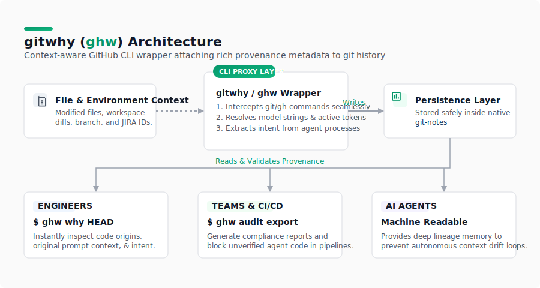

# gitwhy (`ghw`)

[](https://golang.org/dl/)
[](LICENSE)
[](https://github.com/surajsrivastav/gitwhy/actions/workflows/ci.yml)
[](https://github.com/surajsrivastav/gitwhy/actions/workflows/release.yml)
[](https://github.com/surajsrivastav/gitwhy/releases)
[](https://goreportcard.com/report/github.com/surajsrivastav/gitwhy)
[](https://codecov.io/gh/surajsrivastav/gitwhy)
[](https://github.com/surajsrivastav/gitwhy/stargazers)



Every `git commit` already knows *what* changed. gitwhy remembers *why*.

It automatically captures who (or what) made the change, which AI model was involved, the ticket from your branch name, and a one-line summary — all from a plain `git commit`. No flags, no extra commands, no thinking about it.

## Demo

> **[Try the interactive terminal demo →](demo.html)**

A recording of the full workflow (init → commit → `ghw why`) is coming soon. In the meantime, open `demo.html` locally or view it on GitHub Pages to see the annotated commit flow in action.

## Why gitwhy?

**The problem:** AI-generated code is everywhere. Copilot, Claude, Cursor — every commit is a mix of human and AI work. Months later, nobody knows which model produced what, why a change was made, or what spec it came from. Audit trails are empty. Debugging is guesswork.

**What gitwhy does:** Every `git commit` automatically captures provenance — the AI model, the ticket, the intent, the origin (human/spec/AI). Stored locally in git-notes. Zero friction. Plain `git commit` stays plain.

**Who needs this:**
- **Teams shipping AI-generated code** — prove what models produced what
- **Compliance/audit** — trace every change back to a spec or prompt
- **Debugging** — "which model wrote this?" answered in one command
- **Solo devs** — never wonder "why did I do that?" six months later

## Why not just use `git log` or `git blame`?

| | `git log` | `git blame` | **gitwhy** |
|---|---|---|---|
| Shows what changed | ✅ | ✅ | ✅ |
| Shows who changed it | ✅ | ✅ | ✅ |
| Shows **why** it changed | ❌ | ❌ | ✅ |
| Captures AI model used | ❌ | ❌ | ✅ |
| Links ticket/spec | ❌ | ❌ | ✅ |
| Distinguishes human vs AI | ❌ | ❌ | ✅ |
| Zero-friction (plain `git commit`) | ✅ | ✅ | ✅ |

`git log` and `git blame` tell you the **what** and **who**. gitwhy adds the **why**, **what model**, and **what spec** — the context that matters six months later when you're debugging AI-generated code.

## How it works

`ghw init` installs a post-commit hook. After that, every `git commit` silently records provenance in the background. That's it.

```bash
cd your-repo
ghw init                                          # one-time setup
git add . && git commit -m "feat: add login"      # business as usual
ghw why HEAD                                      # see what gitwhy captured
```

```
  gitwhy provenance record
  ─────────────────────────
  schema:    gitwhy/v1
  target:    commit a3f1d8c
  by:        agent:claude-code
  when:      2026-06-25T10:00:00Z

  intent:    add login
  origin:    spec

  context:
    ticket:   PROJ-42
    prompt:   unknown
    model:    claude-sonnet-4-6
    branch:   feature/PROJ-42-login
```

## What gets captured automatically

Just write a normal commit message. gitwhy parses it without any flags.

```bash
git commit -m "feat: add login handler"
```

```
intent:    add login handler      ← from commit message description
origin:    spec                   ← inferred from "feat" type
ticket:    PROJ-42                ← parsed from branch feature/PROJ-42-login
model:     claude-sonnet-4-6      ← detected from $COPILOT_MODEL / $CLAUDE_CODE_MODEL
by:        agent:claude-code      ← detected from $AI_AGENT env var
branch:    feature/PROJ-42-login  ← from git
```

### Commit message → intent

gitwhy reads [conventional commit](https://www.conventionalcommits.org/) format and maps it to provenance fields automatically:

| Commit message | intent | origin |
|---|---|---|
| `feat: add login handler` | `add login handler` | `spec` |
| `fix: null pointer in auth` | `null pointer in auth` | `spec` |
| `perf: cache token lookup` | `cache token lookup` | `spec` |
| `chore: update deps` | `update deps` | `human` |
| `docs: add API examples` | `add API examples` | `human` |
| `test: cover edge cases` | `cover edge cases` | `human` |
| `feat!: breaking auth change` | `BREAKING: breaking auth change` | `spec` |

Non-conventional messages fall back to LLM summarization (if configured) then `"unknown"`.

### Branch name → ticket

gitwhy scans the branch name for a `PROJECT-123` pattern and sets it as the ticket automatically. No flags needed.

```
feature/PROJ-42-login   →  ticket: PROJ-42
fix/AUTH-7-token-null   →  ticket: AUTH-7
main                    →  ticket: unknown
```

### Agent and model → attribution

gitwhy reads environment variables set by AI tools at commit time:

| Tool | Env var read | Captured as |
|---|---|---|
| Claude Code | `AI_AGENT=claude-code/...` | `by: agent:claude-code` |
| Claude Code | `CLAUDE_CODE_MODEL` | `model: claude-sonnet-4-6` |
| GitHub Copilot CLI | `COPILOT_AGENT_MODEL` or `COPILOT_MODEL` | `by: copilot`, `model: gpt-4o` |
| GitHub Copilot CLI | `COPILOT_AGENT_PROMPT` | `prompt: ...` |
| Any tool | `ANTHROPIC_MODEL`, `OPENAI_MODEL`, `GITHUB_MODEL`, `AI_MODEL` | `model: ...` |

If no env var is found, `model` falls back to `default_model` in `.gitwhy/config.yaml`, then `"unknown"`.

Set a default model once, and every commit picks it up:

```bash
ghw config set default_model claude-sonnet-4-6
```

## Commands

| If you want to... | Run this |
|---|---|
| Set up gitwhy in a repo | `ghw init` |
| Check hook health and last capture | `ghw status` |
| Commit with explicit flags | `ghw commit --by copilot --ticket PROJ-42` |
| See provenance for a commit | `ghw why HEAD` |
| Browse annotated history | `ghw log --why` |
| Toggle LLM summary on/off | `ghw config set summary.enabled false` |
| Change LLM command | `ghw config set summary.command claude` |
| Set default model | `ghw config set default_model claude-sonnet-4-6` |
| Export all records | `ghw audit export` |

## Flags (all optional)

Pass these to `ghw commit` when you want to override auto-detection:

| Flag | What it does |
|---|---|
| `--by` | Who: `human`, `copilot`, `agent:<name>` |
| `--intent` | Why: one-line description |
| `--origin` | Source: `human`, `spec`, `prompt`, `template`, `upstream` |
| `--ticket` | Reference: e.g. `Ticket-42` |
| `--spec` | Spec driving the change |
| `--spec-hash` | Spec content hash |
| `--prompt` | Prompt text (if AI-generated) |
| `--model` | Model name (overrides env detection) |
| `-m / --message` | Commit message |

## Configuration

Tweak behavior in `.gitwhy/config.yaml`:

```yaml
backend: git-notes                # how records are stored
auto_capture:
  enabled: true
  default_by: agent:opencode      # default attribution for auto-capture
summary:
  enabled: true                   # generate intent via LLM
  command: llm                    # any CLI that takes a prompt as last arg
  mode: filenames                  # filenames | diff
```

## Install

**Prerequisites:** [Git](https://git-scm.com/), the [GitHub CLI](https://cli.github.com/) (`gh`), and optionally [Go](https://go.dev/dl/) 1.21+ for building from source.

### macOS (Homebrew)

```bash
brew install surajsrivastav/tap/ghw
```

### Pre-built binary (any OS)

Download the latest release for your platform from the [releases page](https://github.com/surajsrivastav/gitwhy/releases):

```bash
# macOS (Apple Silicon)
curl -sL https://github.com/surajsrivastav/gitwhy/releases/latest/download/gitwhy_darwin_arm64.tar.gz | tar xz
sudo mv ghw /usr/local/bin/

# macOS (Intel)
curl -sL https://github.com/surajsrivastav/gitwhy/releases/latest/download/gitwhy_darwin_amd64.tar.gz | tar xz
sudo mv ghw /usr/local/bin/

# Linux (x86_64)
curl -sL https://github.com/surajsrivastav/gitwhy/releases/latest/download/gitwhy_linux_amd64.tar.gz | tar xz
sudo mv ghw /usr/local/bin/

# Linux (ARM64)
curl -sL https://github.com/surajsrivastav/gitwhy/releases/latest/download/gitwhy_linux_arm64.tar.gz | tar xz
sudo mv ghw /usr/local/bin/

# Windows (PowerShell)
curl -sLO https://github.com/surajsrivastav/gitwhy/releases/latest/download/gitwhy_windows_amd64.zip
Expand-Archive gitwhy_windows_amd64.zip -DestinationPath ~\bin
```

### Via Go (if you have Go installed)

```bash
go install github.com/surajsrivastav/gitwhy@latest
```

### Or build from source

```bash
git clone https://github.com/surajsrivastav/gitwhy.git
cd gitwhy
make build
sudo mv ghw /usr/local/bin/
```

### Install script

```bash
curl -sSfL https://raw.githubusercontent.com/surajsrivastav/gitwhy/master/install.sh | sh
```

## Project structure

```
cmd/          - CLI commands
pkg/
  provenance/ - What a record looks like
  config/     - Reading/writing .gitwhy/config.yaml
  storage/    - Where records live (git-notes or files)
  drift/      - Tracking spec changes over time
  audit/      - Reports and exports
  passthrough/ - Handing unknown commands to `gh`
```

## Testing

```bash
make test       # run all tests
make coverage   # coverage report
make vet        # check for issues
```

## License

MIT — see [LICENSE](LICENSE).

## Questions?

Check the [PRD](PRD.md) for detailed specs, or open an issue on GitHub.
